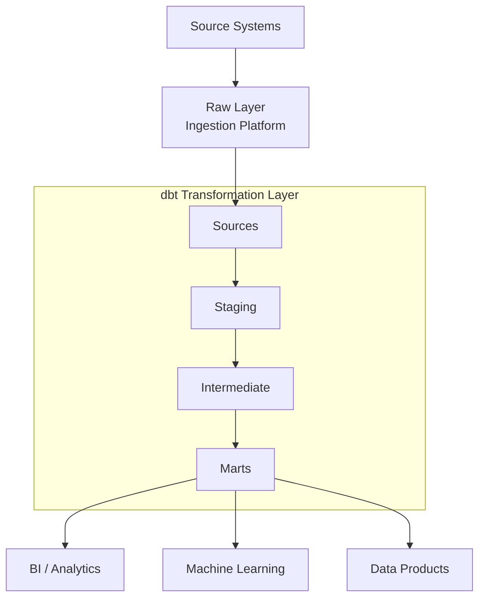

# dbt Transformation Template

A practical, production-minded template for building **dbt-powered analytics and transformation solutions**. It includes ready-made patterns for **source definitions**, **staging models**, **intermediate transformations**, **fact and dimension marts**, **data quality testing**, **snapshots for historical tracking**, **reusable macros**, and **CI/CD deployment pipelines**.


Use this as a GitHub Template Repository to provide a fast, consistent starting point for analytics engineering projects across **Snowflake**, **Databricks**, **BigQuery**, **Redshift**, and other supported dbt platforms.

---
## What's Included
- **End-to-end transformation flow**: Sources → Staging → Intermediate → Marts → Analytics
  
- **dbt modelling patterns**: Source definitions, staging models, reusable business transformations, facts and dimensions

- **Data quality framework**: Generic tests, custom tests, documentation, and lineage tracking

- **Analytics engineering features**: Snapshots (SCD Type 2), seeds, macros, incremental models, and reusable utilities

- **Developer experience**: Configuration files, example models, Makefile, GitHub Actions, and documented best practices

- **Platform agnostic**: Designed to work with Snowflake, Databricks, BigQuery, Redshift, and other dbt-supported warehouses
 
---

## Reference Architecture




## Project Layout

```text
.
├── .github/
│   └── workflows/                         # GitHub Actions CI/CD pipelines
│       ├── ci.yml                         # Validation, testing and linting workflow
│       └── deploy.yml                     # Deployment workflow
│
├── config/                               # Environment-specific configuration
│   ├── dev.yml                           # Development settings
│   ├── test.yml                          # Test/UAT settings
│   └── prod.yml                          # Production settings
│
├── models/                               # dbt transformation layers
│   │
│   ├── sources/                          # Source definitions
│   │   ├── src_customers.yml             # Customer source metadata
│   │   └── src_sales.yml                 # Sales source metadata
│   │
│   ├── staging/                          # Data standardisation layer
│   │   │
│   │   ├── customers/
│   │   │   ├── stg_customers.sql         # Clean and standardise customer data
│   │   │   └── stg_customers.yml         # Tests and documentation
│   │   │
│   │   └── sales/
│   │       ├── stg_sales.sql             # Clean and standardise sales data
│   │       └── stg_sales.yml             # Tests and documentation
│   │
│   ├── intermediate/                     # Reusable business logic
│   │   ├── int_customer_orders.sql       # Customer order metrics
│   │   └── int_customer_revenue.sql      # Customer revenue metrics
│   │
│   └── marts/                            # Business-facing analytics models
│       ├── dimensions/
│       │   ├── dim_customer.sql          # Customer dimension
│       │   └── dim_product.sql           # Product dimension
│       │
│       └── facts/
│           ├── fct_orders.sql            # Order fact table
│           └── fct_sales.sql             # Sales fact table
│
├── macros/                               # Reusable dbt macros
│   ├── generate_surrogate_key.sql        # Generate warehouse surrogate keys
│   ├── get_latest_record.sql             # Latest record helper
│   └── date_spine.sql                    # Calendar/date generation utility
│
├── snapshots/                            # Historical tracking (SCD Type 2)
│ └── customer_snapshot.sql               # Customer history snapshot
│
├── tests/                                # Custom data quality tests
│ ├── assert_positive_revenue.sql         # Validate revenue values
│ └── assert_valid_order_status.sql       # Validate order statuses
│
├── seeds/                                # Reference data loaded by dbt
│ └── reference_data.csv                  # Example lookup dataset
│
├── dbt_project.yml                       # Main dbt project configuration
├── packages.yml                          # dbt package dependencies
├── profiles.yml.example                  # Example local profile configuration
├── Makefile                              # Common development commands
├── requirements.txt                      # dbt adapters, packages, SQL linting, testing and development dependencies
└── README.md                             # Repository documentation
```

## Naming Convention Notation
- **src_*** = Source definitions

- **stg_*** = Staging models
        One source table -> one staging model

- **int_*** = Intermediate models
        Reusable business logic

- **dim_*** = Dimension tables
        Descriptive business entities

- **fct_*** = Fact tables
        Measurable business events

- **rpt_*** = Reporting layer (optional)

- **snapshots/*** = Historical tracking

- **tests/*** = Custom data quality tests

- **macros/*** = Reusable SQL functions

---

## Quick Start

```bash
pip install -r requirements.txt

dbt deps

dbt debug

dbt build
```
---

## Documentation

dbt can automatically generate interactive project documentation, including:

- Model descriptions
- Column descriptions
- Data lineage
- Source definitions
- Tests
- Exposures
- Dependencies between models

### Add Documentation to Models

Include descriptions in your YAML files:

```yaml
version: 2

models:
  - name: dim_customer
    description: Master customer dimension used for reporting.

    columns:
      - name: customer_id
        description: Unique customer identifier.

      - name: customer_name
        description: Customer full name.

      - name: customer_status
        description: Current customer status.
```

### Generate Documentation

Build the catalog and metadata files:

```bash
dbt docs generate
```

This creates documentation artifacts in the `target/` folder.

### View Documentation Locally

Start the local documentation server:

```bash
dbt docs serve
```

By default, dbt will launch a local web server:

```text
http://localhost:8080
```

You can then explore:

- Project overview
- Model lineage graph
- Source-to-mart data flows
- Model metadata
- Tests and documentation coverage

### Typical Workflow

Generate documentation after changes to models, sources, or tests:

```bash
dbt build
dbt docs generate
dbt docs serve
```

### Example Lineage

```text
src_customers
      │
      ▼
stg_customers
      │
      ▼
dim_customer
      │
      ▼
Power BI Dashboard
```

Within dbt Docs this lineage is displayed as an interactive dependency graph.

### Documentation Best Practices

✅ Add descriptions to all models

✅ Add descriptions to all columns

✅ Document all sources

✅ Generate docs during CI/CD

✅ Review lineage periodically

✅ Keep business definitions close to the models

❌ Do not leave production-facing models undocumented

### CI/CD Example

Generate documentation during deployment:

```yaml
- name: Generate dbt Docs
  run: dbt docs generate
```

Documentation artifacts (`manifest.json`, `catalog.json`) can then be published to a static website, cloud storage, or dbt Cloud.

### Makefile Commands

The template includes a helper command:

```bash
make docs
```

Which runs:

```bash
dbt docs generate
```

To view documentation locally:

```bash
dbt docs serve
```

---
