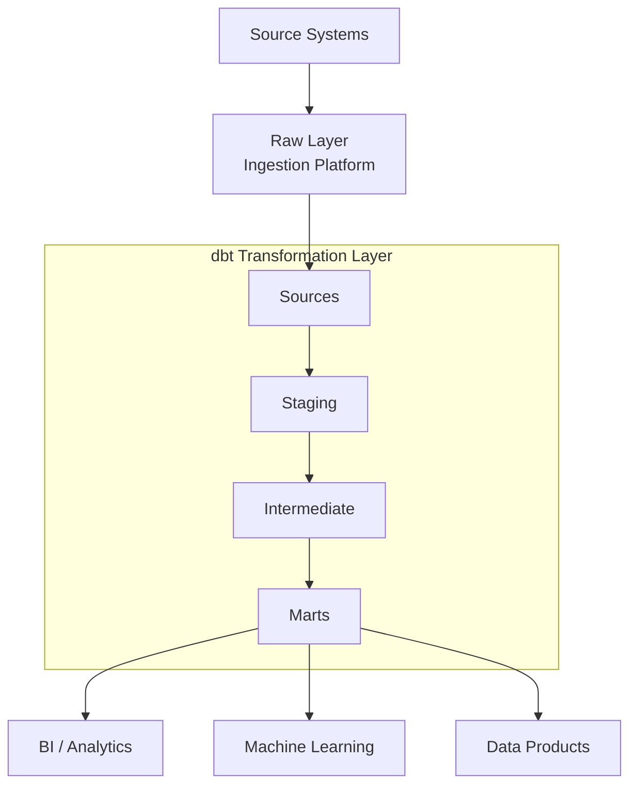

# pa-int-template-dbt

## What's Included
- Layered architecture: Sources → Staging → Intermediate → Marts
- Testing framework: Schema, uniqueness, referential integrity, custom tests
- Documentation: Auto-generated dbt docs
- Reusable macros: Standardised transformation patterns
- Incremental loading: Examples for large datasets
- Snapshots: SCD Type 2 history tracking
- CI/CD: GitHub Actions validation and deployment
- Developer experience: Makefile, linting, SQL formatting, pre-commit hooks
- Warehouse support: Snowflake, Databricks, BigQuery, Redshift

---

## Reference Architecture




## Project Layout

```text
.
├── .github/
│   └── workflows/                         # GitHub Actions CI/CD pipelines
│       ├── ci.yml                         # Validation, testing and linting workflow
│       └── deploy.yml                     # Deployment workflow
│
├── config/                               # Environment-specific configuration
│   ├── dev.yml                           # Development settings
│   ├── test.yml                          # Test/UAT settings
│   └── prod.yml                          # Production settings
│
├── models/                               # dbt transformation layers
│   │
│   ├── sources/                          # Source definitions
│   │   ├── src_customers.yml             # Customer source metadata
│   │   └── src_sales.yml                 # Sales source metadata
│   │
│   ├── staging/                          # Data standardisation layer
│   │   │
│   │   ├── customers/
│   │   │   ├── stg_customers.sql         # Clean and standardise customer data
│   │   │   └── stg_customers.yml         # Tests and documentation
│   │   │
│   │   └── sales/
│   │       ├── stg_sales.sql             # Clean and standardise sales data
│   │       └── stg_sales.yml             # Tests and documentation
│   │
│   ├── intermediate/                     # Reusable business logic
│   │   ├── int_customer_orders.sql       # Customer order metrics
│   │   └── int_customer_revenue.sql      # Customer revenue metrics
│   │
│   └── marts/                            # Business-facing analytics models
│       ├── dimensions/
│       │   ├── dim_customer.sql          # Customer dimension
│       │   └── dim_product.sql           # Product dimension
│       │
│       └── facts/
│           ├── fct_orders.sql            # Order fact table
│           └── fct_sales.sql             # Sales fact table
│
├── macros/                               # Reusable dbt macros
│   ├── generate_surrogate_key.sql        # Generate warehouse surrogate keys
│   ├── get_latest_record.sql             # Latest record helper
│   └── date_spine.sql                    # Calendar/date generation utility
│
├── snapshots/                            # Historical tracking (SCD Type 2)
│ └── customer_snapshot.sql               # Customer history snapshot
│
├── tests/                                # Custom data quality tests
│ ├── assert_positive_revenue.sql         # Validate revenue values
│ └── assert_valid_order_status.sql       # Validate order statuses
│
├── seeds/                                # Reference data loaded by dbt
│ └── reference_data.csv                  # Example lookup dataset
│
├── dbt_project.yml                       # Main dbt project configuration
├── packages.yml                          # dbt package dependencies
├── profiles.yml.example                  # Example local profile configuration
├── Makefile                              # Common development commands
└── README.md                             # Repository documentation
```

## Naming Convention Notation
src_* = Source definitions

stg_* = Staging models
        One source table -> one staging model

int_* = Intermediate models
        Reusable business logic

dim_* = Dimension tables
        Descriptive business entities

fct_* = Fact tables
        Measurable business events

rpt_* = Reporting layer (optional)

snapshots/* = Historical tracking

tests/* = Custom data quality tests

macros/* = Reusable SQL functions

---

## Quick Start

```bash
pip install -r requirements.txt

dbt deps

dbt debug

dbt build
```
