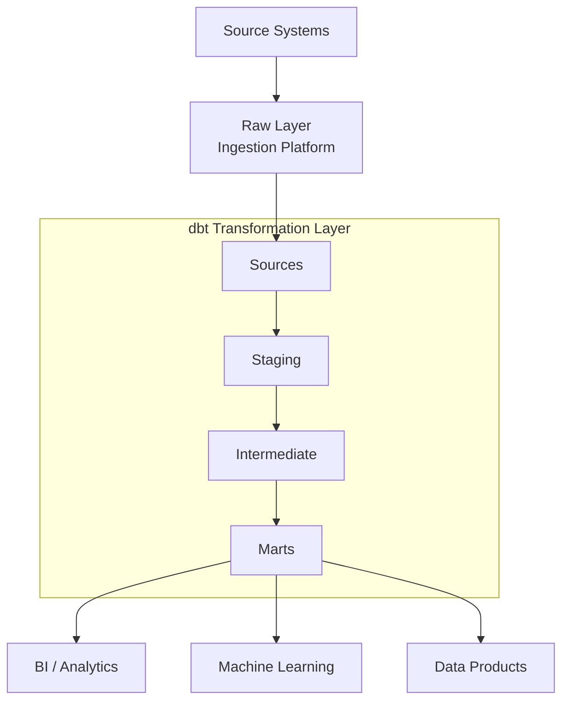

# pa-int-template-dbt

## What's Included
- Layered architecture: Sources → Staging → Intermediate → Marts
- Testing framework: Schema, uniqueness, referential integrity, custom tests
- Documentation: Auto-generated dbt docs
- Reusable macros: Standardised transformation patterns
- Incremental loading: Examples for large datasets
- Snapshots: SCD Type 2 history tracking
- CI/CD: GitHub Actions validation and deployment
- Developer experience: Makefile, linting, SQL formatting, pre-commit hooks
- Warehouse support: Snowflake, Databricks, BigQuery, Redshift

---

## Reference Architecture




## Project Layout

models/

├── sources/
│   ├── src_customers.yml
│   └── src_sales.yml
│
├── staging/
│   ├── customers/
│   │   ├── stg_customers.sql
│   │   └── stg_customers.yml
│   │
│   └── sales/
│       ├── stg_sales.sql
│       └── stg_sales.yml
│
├── intermediate/
│   ├── int_customer_orders.sql
│   └── int_customer_revenue.sql
│
└── marts/
    ├── dimensions/
    │   ├── dim_customer.sql
    │   └── dim_product.sql
    │
    └── facts/
        ├── fct_orders.sql
        └── fct_sales.sql

macros/
│
├── generate_surrogate_key.sql
├── get_latest_record.sql
└── date_spine.sql

snapshots/
│
└── customer_snapshot.sql

tests/
│
├── assert_positive_revenue.sql
└── assert_valid_order_status.sql

seeds/
│
└── reference_data.csv

config/
│
├── dev.yml
├── test.yml
└── prod.yml

.github/workflows/
│
├── ci.yml
└── deploy.yml

dbt_project.yml
packages.yml
profiles.yml.example
Makefile
README.md

## Naming Convention Notation
src_* = Source definitions

stg_* = Staging models
        One source table -> one staging model

int_* = Intermediate models
        Reusable business logic

dim_* = Dimension tables
        Descriptive business entities

fct_* = Fact tables
        Measurable business events

rpt_* = Reporting layer (optional)

snapshots/* = Historical tracking

tests/* = Custom data quality tests

macros/* = Reusable SQL functions

---

## Quick Start

```bash
pip install -r requirements.txt

dbt deps

dbt debug

dbt build
```
